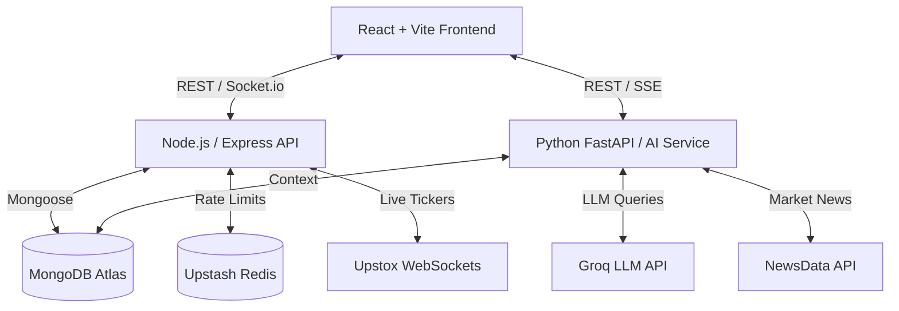

<div align="center">
  
  <h1>ArthaYukti (अर्थयुक्ति)</h1>
  <p><strong>Next-Generation AI-Powered Paper Trading & Portfolio Management Platform</strong></p>

  [](https://reactjs.org/)
  [](https://nodejs.org/)
  [](https://python.org/)
  [](https://fastapi.tiangolo.com/)
  [](https://mongodb.com/)
  [](https://docker.com/)
</div>

<br />

ArthaYukti is a production-grade, distributed microservice application designed to simulate the Indian Stock Market. It offers real-time paper trading, virtual wallet management, and an advanced AI Co-Pilot that provides portfolio analysis, stock insights, and machine learning price forecasts.

## ✨ Key Features

- **Live Market Data:** Real-time WebSocket streaming of NSE/BSE stock prices via Upstox API.
- **Paper Trading Engine:** Execute buy/sell orders with virtual money using ACID-compliant MongoDB transactions.
- **AI Co-Pilot:** A LangChain-powered conversational agent (via Groq/LLaMA) that answers financial queries and analyzes your portfolio risk.
- **Machine Learning Forecasting:** Time-series forecasting (Holt-Winters Exponential Smoothing) built into the Python AI microservice to predict 30-day stock trends.
- **Virtual Wallet Integration:** Simulated wallet top-ups using Razorpay Test Mode.
- **Secure Authentication:** Google OAuth 2.0 and JWT-based session management.
- **High-Performance Caching:** Upstash Redis handles rate-limiting and reduces external API calls.

## 🏗️ Architecture

ArthaYukti is built on a distributed microservices architecture to separate the high-concurrency Node.js WebSocket server from the CPU-intensive Python AI/ML workloads.



## 🛠️ Tech Stack

### Frontend (Client)
- **Framework:** React 18, Vite
- **State Management:** Redux Toolkit
- **Styling:** TailwindCSS, Lucide React
- **Charting:** Recharts

### Backend (Server)
- **Runtime:** Node.js, Express.js
- **Database:** MongoDB (Mongoose)
- **Real-time:** Socket.io
- **Payments:** Razorpay API

### AI Microservice
- **Framework:** Python 3.11, FastAPI, Uvicorn
- **AI & ML:** LangChain, Groq, Pandas, Statsmodels (Time Series)
- **Streaming:** Server-Sent Events (SSE)

---

## 🚀 Running Locally (Docker)

The absolute easiest way to run the entire backend infrastructure (Node API, Python AI API, and Redis) locally is using Docker.

1. **Clone the repository:**
   ```bash
   git clone https://github.com/Chintan616/ArthaYukti.git
   cd ArthaYukti
   ```

2. **Set up Environment Variables:**
   - Create a `.env` file in the `/server` directory and add your credentials (`MONGO_URI`, `JWT_SECRET`, `UPSTOX_ACCESS_TOKEN`, `GOOGLE_CLIENT_ID`, etc.).
   - Create a `.env` file in the `/ai-service` directory and add your AI credentials (`GROQ_API_KEY`, `NEWSDATA_API_KEY`, `MONGO_URI`).

3. **Start the Backend Microservices:**
   ```bash
   docker-compose up --build
   ```
   *This single command builds and starts the Node.js API on port 5001, the Python FastAPI on port 8000, and a local Redis container on port 6379.*

4. **Start the Frontend:**
   Open a new terminal window:
   ```bash
   cd client
   npm install
   npm run dev
   ```

Visit `http://localhost:5173` to view the application!

---

## ☁️ Deployment

ArthaYukti is fully configured for cloud deployment:
- **Frontend:** Deployed on [Vercel](https://vercel.com).
- **Node.js API:** Deployed on [Render](https://render.com) (Web Service).
- **Python AI API:** Deployed on [Render](https://render.com) (Web Service).

*(Note: Free-tier Render servers may take 30-50 seconds to "wake up" upon first visit if inactive for 15 minutes).*
